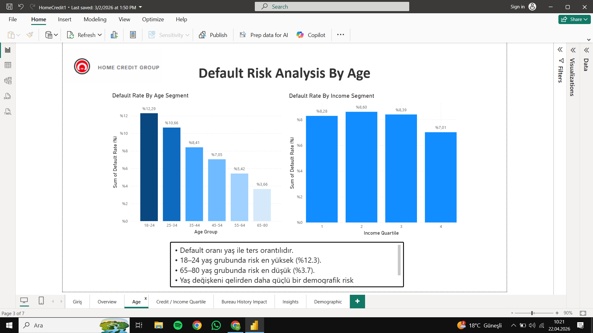

# Home Credit Default Risk Prediction 🏦

Bu proje, **Home Credit** tarafından sağlanan veriler kullanılarak, kredi başvurusunda bulunan müşterilerin temerrüt (borç ödeyememe) riskini tahmin etmek amacıyla geliştirilmiştir. Proje; veri temizleme, özellik mühendisliği (feature engineering), makine öğrenmesi modellemesi ve interaktif raporlama süreçlerini kapsamaktadır.

## 📂 Veri Seti
Analiz aşamasında kullanılan veri seti Kaggle üzerinden temin edilmiştir:
🔗 [Home Credit Default Risk - Kaggle](https://www.kaggle.com/c/home-credit-default-risk/data)

## 📊 Proje Bileşenleri

### 1. Veri Analizi ve İş Zekası (Power BI)
Veri setindeki demografik ve finansal değişkenlerin risk üzerindeki etkilerini incelemek için interaktif bir dashboard hazırlanmıştır.
- **Temel Bulgular:** Yaş ile temerrüt oranı arasındaki ters orantı ve gelir segmentlerinin risk üzerindeki etkisi analiz edilmiştir.
- **Dosya:** `reports/Home-Credit.pbix`

### 2. Makine Öğrenmesi Modellemesi (Python & Colab)
Kredi riskini tahmin etmek için Python kütüphaneleri kullanılarak uçtan uca bir pipeline oluşturulmuştur.
- **Kütüphaneler:** Pandas, NumPy, Scikit-learn, LightGBM/XGBoost, Matplotlib, Seaborn.
- **Süreç:** Eksik veri yönetimi, aykırı değer analizi, label/one-hot encoding ve model hiperparametre optimizasyonu.
- **Dosya:** `notebooks/Home-Credit-Modeling.ipynb`

## 📈 Öne Çıkan Analizler
Aşağıdaki görselde, yaş gruplarına göre temerrüt oranlarının değişimi görülmektedir. Analizlerimize göre genç yaş grubunda risk oranının daha yüksek olduğu tespit edilmiştir.

 
*(Not: Görselin görünmesi için visuals klasörüne yüklediğin dosya adıyla eşleşmelidir)*

## 🛠️ Kurulum ve Çalıştırma
Projeyi yerelinizde çalıştırmak için:
1. Depoyu klonlayın: `git clone https://github.com/[hamza-simsek]/[Home-Credit-Default-Risk].git`
2. Gereksinimleri yükleyin: `pip install -r requirements.txt`
3. Notebook dosyasını Jupyter veya Google Colab üzerinden açın.

## 📄 Lisans
Bu proje [MIT License](LICENSE) altında lisanslanmıştır.
